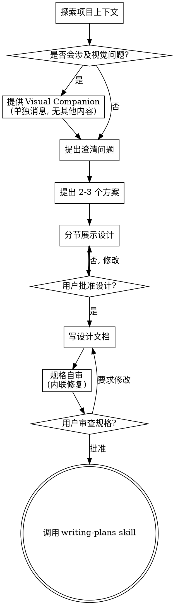

# 从想法到设计

通过自然协作对话，把想法变成完整设计和规格。

先理解当前项目上下文，再一次只问一个问题来细化想法。理解要构建的内容后，提出设计并获得用户确认。

<HARD-GATE>
在你提出设计并获得用户批准之前，不得调用任何实现 skill、编写代码、搭建项目或采取任何实现动作。无论项目看起来多简单，都适用。
</HARD-GATE>

## 反模式：“太简单，不需要设计”

每个项目都要经过这个流程。todo list、单函数工具、配置改动也一样。越是“简单”的项目，越容易被未经检查的假设拖累。设计可以很短，真正简单的任务几句话即可，但必须提出设计并获得确认。

## Checklist

必须为以下每项创建任务，并按顺序完成：

1. **探索项目上下文**：检查文件、文档、最近提交。
2. **提供视觉伴侣**：如果主题会涉及视觉问题，单独发一条消息提供该选项，不要和澄清问题混在一起。见下方 Visual Companion。
3. **提出澄清问题**：一次一个，理解目的、约束和成功标准。
4. **提出 2-3 个方案**：说明权衡和推荐方案。
5. **展示设计**：按复杂度分节展示，每节后获取用户确认。
6. **写设计文档**：保存到 `docs/superpowers/specs/YYYY-MM-DD-<topic>-design.md` 并提交。
7. **规格自审**：快速检查占位符、矛盾、歧义和范围。
8. **用户审查书面规格**：要求用户先审查 spec 文件，再继续。
9. **转入实现**：调用 `writing-plans` skill 创建实施计划。

## 流程图

终点是调用 `writing-plans`。不要调用 frontend-design、mcp-builder 或其他实现 skill。brainstorming 之后唯一应调用的 skill 是 `writing-plans`。

## 具体流程

### 理解想法

- 先查看当前项目状态，包括文件、文档和最近提交。
- 细问之前先判断范围。如果用户请求包含多个独立子系统，例如聊天、文件存储、计费和分析平台，立即指出需要拆分，不要花问题去细化一个过大的整体项目。
- 如果项目太大，帮助用户拆成子项目：独立部分是什么、彼此如何关联、按什么顺序构建。然后对第一个子项目按正常流程 brainstorm。每个子项目都有自己的 spec、plan 和 implementation cycle。
- 范围合适时，一次只问一个问题来细化想法。
- 能用多选就优先多选，开放式问题也可以。
- 一条消息只问一个问题。如果一个主题需要更多探索，拆成多轮。
- 聚焦理解目的、约束和成功标准。

### 探索方案

- 提出 2-3 个不同方案及其权衡。
- 用对话方式说明选项、推荐方案和理由。
- 先给推荐方案，再解释原因。

### 展示设计

- 当你认为已经理解要构建的东西时，展示设计。
- 每节按复杂度控制长度：简单场景几句话，复杂场景最多约 200-300 字。
- 每节后询问“到目前为止是否正确”。
- 覆盖架构、组件、数据流、错误处理和测试。
- 如果某处不清楚，回到澄清阶段。

### 为隔离和清晰而设计

- 把系统拆成更小的单元，每个单元有清晰目的，通过明确接口交互，并可独立理解和测试。
- 对每个单元都应能回答：它做什么、如何使用、依赖什么。
- 如果不读内部实现就无法理解单元职责，或修改内部会破坏消费者，说明边界需要调整。
- 较小且边界清晰的单元更容易推理，编辑也更可靠。文件过大通常意味着职责过多。

### 在现有代码库中工作

- 提案前先探索当前结构，遵循现有模式。
- 如果现有代码问题会影响本次工作，例如文件过大、边界不清、职责纠缠，应把针对性改进纳入设计。
- 不做无关重构。只处理服务当前目标的改进。

## 设计之后

### 文档

- 将验证后的设计保存到 `docs/superpowers/specs/YYYY-MM-DD-<topic>-design.md`。
- 如果用户指定了 spec 位置，按用户偏好。
- 如果可用，可使用 `elements-of-style:writing-clearly-and-concisely` skill。
- 将设计文档提交到 git。

### 规格自审

写完 spec 后，用新视角检查：

1. **占位符扫描:** 是否有 TBD、TODO、未完成章节或模糊需求。发现就修。
2. **内部一致性:** 各章节是否互相矛盾，架构是否匹配功能描述。
3. **范围检查:** 是否足够聚焦，能进入单个实施计划；如果不能，需要拆分。
4. **歧义检查:** 是否有需求能被解释成两种意思。选择一种并写明确。

直接内联修复问题，无需再做一轮审查。

### 用户审查门

自审通过后，请用户审查书面 spec：

> “Spec 已写入并提交到 `<path>`。请先审查，如果需要改动，请告诉我；确认后我再开始写实施计划。”

等待用户回应。如果用户要求修改，修改后重新执行自审。只有用户批准后才继续。

### 实现

- 调用 `writing-plans` skill 创建详细实施计划。
- 不要调用其他 skill。下一步就是 `writing-plans`。

## 核心原则

- **一次一个问题**：不要用多个问题压垮用户。
- **优先多选**：可行时多选比开放题更容易回答。
- **严格 YAGNI**：从设计中移除不必要功能。
- **探索替代方案**：定案前总是提出 2-3 个方案。
- **增量验证**：展示设计，得到批准后再继续。
- **保持灵活**：不合理时回到澄清。

## Visual Companion

Visual Companion 是浏览器中的辅助工具，用于在 brainstorm 时展示 mockups、diagram 和视觉选项。它是工具，不是模式。用户同意后，只表示它可用于适合视觉呈现的问题，不表示每个问题都要进浏览器。

**提供方式:** 当你预期后续问题会涉及视觉内容，例如 mockups、布局、diagram，单独发一条请求授权：

> “接下来有些内容可能用浏览器展示会更容易理解。我可以边讨论边做 mockups、diagram、对比图和其他视觉材料。这个功能还比较新，可能会消耗较多 token。要试试吗？（需要打开本地 URL）”

这条消息必须单独发送。不要和澄清问题、上下文总结或其他内容合并。等待用户回应后再继续。如果用户拒绝，就用纯文本 brainstorm。

**逐问题判断:** 即使用户同意，也要对每个问题判断用浏览器还是终端。判断标准：用户是看见它比阅读它更容易理解吗？

- **使用浏览器**：mockups、wireframes、布局对比、架构图、并排视觉设计等真正视觉内容。
- **使用终端**：需求问题、概念选择、权衡列表、A/B/C/D 文本选项、范围决策等文本内容。

UI 主题不自动等于视觉问题。“这个语境里的 personality 是什么意思？”是概念问题，用终端。“哪种 wizard 布局更好？”是视觉问题，用浏览器。

如果用户同意使用 Visual Companion，继续前先阅读：

`skills/brainstorming/visual-companion.md`
