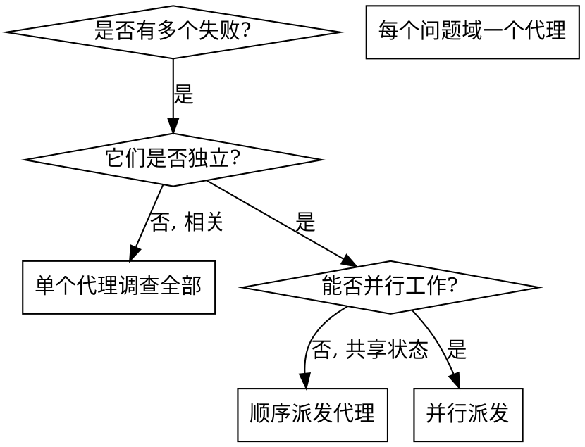

# 派发并行代理

## 概览

把独立问题委派给专门代理，并为每个代理提供精确、隔离的上下文。代理不应继承你的完整会话历史；你只给它完成任务所需的信息。这样既能让代理聚焦，也能保留主会话上下文用于协调和集成。

当多个失败属于不同测试文件、不同子系统或不同 bug 时，串行调查会浪费时间。每个独立问题都可以并行推进。

**核心原则:** 每个独立问题域派发一个代理，并让它们同时工作。

## 何时使用



**适用情况：**

- 3 个以上测试文件失败，且根因不同。
- 多个子系统独立损坏。
- 每个问题都能在不依赖其他上下文的情况下理解。
- 调查之间没有共享状态。

**不适用情况：**

- 失败彼此相关，修一个可能影响其他。
- 必须先理解完整系统状态。
- 代理会互相干扰，例如编辑同一文件或使用同一资源。

## 模式

### 1. 识别独立问题域

按损坏点分组：

- 文件 A 的测试：工具审批流程。
- 文件 B 的测试：批处理完成行为。
- 文件 C 的测试：中止功能。

每个域都独立，修工具审批不会影响中止测试。

### 2. 创建聚焦的代理任务

每个代理都应获得：

- **明确范围:** 一个测试文件或一个子系统。
- **清晰目标:** 让这些测试通过。
- **约束条件:** 不要修改其他代码。
- **预期输出:** 总结发现和修改。

### 3. 并行派发

```typescript
// Claude Code / AI environment 示例
Task("修复 agent-tool-abort.test.ts 的失败")
Task("修复 batch-completion-behavior.test.ts 的失败")
Task("修复 tool-approval-race-conditions.test.ts 的失败")
// 三个任务并发运行
```

### 4. 审查并集成

代理返回后：

- 读取每份总结。
- 确认修复不会冲突。
- 运行完整测试套件。
- 集成所有变更。

## 代理 Prompt 结构

好的代理 prompt 应该：

1. **聚焦:** 只有一个清晰问题域。
2. **自包含:** 包含理解问题所需的全部上下文。
3. **明确输出:** 说明代理应该返回什么。

```markdown
修复 src/agents/agent-tool-abort.test.ts 中 3 个失败测试：

1. "should abort tool with partial output capture" - 期望消息包含 'interrupted at'
2. "should handle mixed completed and aborted tools" - fast tool 被 abort，而不是 completed
3. "should properly track pendingToolCount" - 期望 3 个结果，实际为 0

这些看起来是 timing/race condition 问题。你的任务：

1. 读取测试文件，理解每个测试验证什么。
2. 找出根因，是测试时序问题还是实现 bug。
3. 修复方式：
   - 用事件驱动等待替换任意 timeout。
   - 如果发现 abort 实现 bug，修复实现。
   - 如果测试验证的是已变更行为，调整测试预期。

不要只是增加 timeout，必须找到真实问题。

返回：根因总结和修改内容。
```

## 常见错误

**太宽泛:** “修复所有测试”会让代理迷失。  
**更好:** “修复 agent-tool-abort.test.ts”，范围聚焦。

**没有上下文:** “修复 race condition”不知道在哪里。  
**更好:** 贴出错误消息和测试名。

**没有约束:** 代理可能重构所有东西。  
**更好:** 明确“不要修改生产代码”或“只修测试”。

**输出模糊:** “修好它”让你不知道发生了什么。  
**更好:** 要求“返回根因和变更总结”。

## 不要使用的场景

- 相关失败：修一个可能修掉或改变其他，应先一起调查。
- 需要完整上下文：理解问题必须看整个系统。
- 探索性调试：还不知道什么坏了。
- 共享状态：代理会互相干扰。

## 真实示例

场景：一次大重构后，3 个文件中出现 6 个测试失败。

失败：

- `agent-tool-abort.test.ts`：3 个失败，时序问题。
- `batch-completion-behavior.test.ts`：2 个失败，工具没有执行。
- `tool-approval-race-conditions.test.ts`：1 个失败，执行计数为 0。

判断：三个域独立，abort 逻辑、batch completion 和 race condition 可以分开处理。

派发：

```text
Agent 1 -> 修复 agent-tool-abort.test.ts
Agent 2 -> 修复 batch-completion-behavior.test.ts
Agent 3 -> 修复 tool-approval-race-conditions.test.ts
```

结果：

- Agent 1：用事件驱动等待替换 timeout。
- Agent 2：修复事件结构 bug，`threadId` 放错位置。
- Agent 3：增加等待，确保异步工具执行完成。

集成：修复彼此独立，无冲突，完整套件通过。

## 主要收益

1. **并行化:** 多个调查同时发生。
2. **聚焦:** 每个代理上下文更小。
3. **独立:** 代理之间不互相干扰。
4. **速度:** 多个问题用接近一个问题的时间解决。

## 验证

代理返回后：

1. 审查每份总结，理解修改。
2. 检查是否编辑了相同代码。
3. 运行完整测试，确认组合后仍然有效。
4. 抽查结果，代理可能犯系统性错误。
