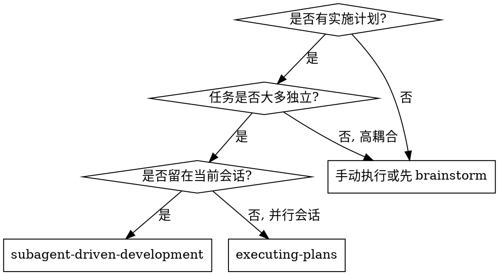
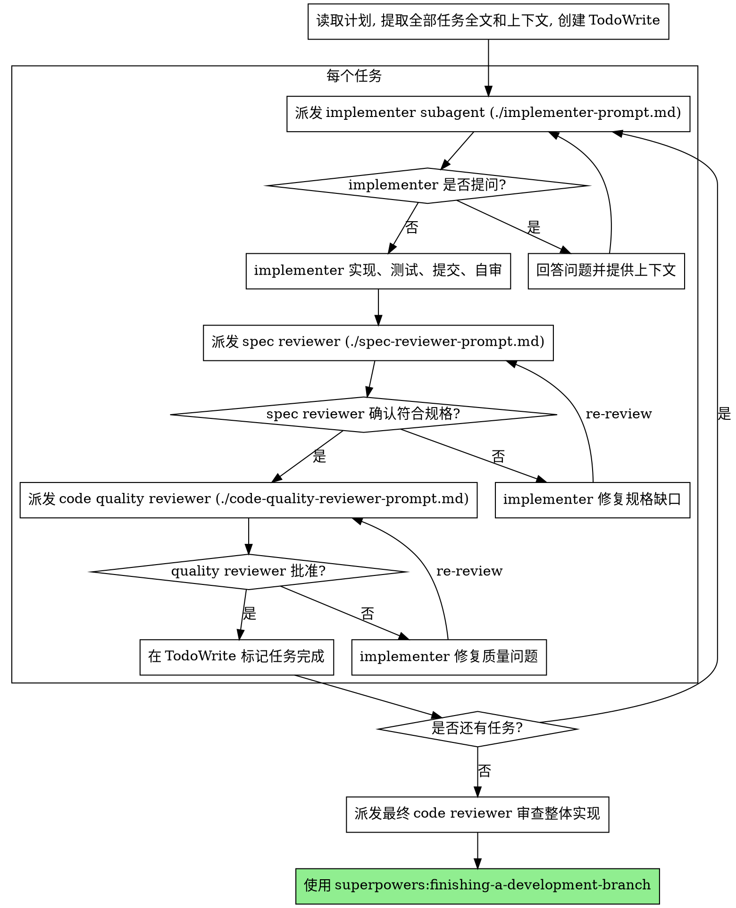

# 子代理驱动开发

通过“每个任务一个 fresh subagent”的方式执行计划。每个任务后做两阶段审查：先规格符合性审查，再代码质量审查。

**为什么使用子代理:** 你把任务委派给上下文隔离的专门代理。通过精确构造指令和上下文，让代理保持聚焦并完成任务。代理不应继承你的会话历史；你只提供它完成任务所需的信息。主会话保留用于协调和集成。

**核心原则:** 每个任务 fresh subagent + 两阶段审查（spec 再 quality）= 高质量、快速迭代。

**连续执行:** 不要在任务之间停下来问用户是否继续。执行计划中的全部任务。只有三种停止理由：出现无法解决的 BLOCKED、存在真正阻止前进的歧义、所有任务完成。用户要求你执行计划，就执行计划。

## 何时使用



与 `executing-plans` 相比：

- 保持在同一会话，无需切换上下文。
- 每个任务使用 fresh subagent，避免上下文污染。
- 每个任务后做两阶段审查：规格符合性，再代码质量。
- 任务之间不需要用户介入，迭代更快。

## 流程



## 模型选择

用能胜任该角色的最低成本模型，节省成本并提升速度。

- **机械实现任务**：隔离函数、清晰规格、1-2 个文件，使用快速低成本模型。
- **集成和判断任务**：多文件协调、模式匹配、调试，使用标准模型。
- **架构、设计、审查任务**：使用可用的最强模型。

复杂度信号：

- 完整规格且只改 1-2 个文件：低成本模型。
- 多文件且有集成问题：标准模型。
- 需要设计判断或广泛理解代码库：最强模型。

## 处理 Implementer 状态

Implementer 返回四类状态：

**DONE:** 进入规格符合性审查。

**DONE_WITH_CONCERNS:** 工作完成但有疑虑。先阅读疑虑。如果涉及正确性或范围，审查前处理；如果只是观察，例如文件变大，记录后继续审查。

**NEEDS_CONTEXT:** 缺少上下文。提供缺失信息并重新派发。

**BLOCKED:** 无法完成任务。评估阻塞：

1. 如果是上下文问题，提供更多上下文，用同一模型重派。
2. 如果需要更强推理，换更强模型重派。
3. 如果任务过大，拆小。
4. 如果计划本身错误，升级给用户。

不要忽略升级，也不要不改变条件就让同一模型硬重试。它说卡住，说明需要改变输入、范围或模型。

## Prompt 模板

- `./implementer-prompt.md`：派发实现子代理。
- `./spec-reviewer-prompt.md`：派发规格符合性审查子代理。
- `./code-quality-reviewer-prompt.md`：派发代码质量审查子代理。

## 示例流程

```text
You: 我正在使用 Subagent-Driven Development 执行这个计划。

[读取计划文件: docs/superpowers/plans/feature-plan.md]
[提取 5 个任务的全文和上下文]
[创建 TodoWrite]

Task 1: Hook installation script

[派发实现子代理，提供完整任务文本和上下文]

Implementer: “开始前确认：hook 安装在 user level 还是 system level？”
You: “User level (~/.config/superpowers/hooks/)”

Implementer:
  - Implemented install-hook command
  - Added tests, 5/5 passing
  - Self-review: missed --force flag, added it
  - Committed

[派发 spec reviewer]
Spec reviewer: 符合规格，所有要求满足，没有额外内容。

[获取 git SHAs，派发 code quality reviewer]
Code reviewer: 覆盖良好，结构清晰。无问题，批准。

[标记 Task 1 完成]
```

## 优势

相对手动执行：

- 子代理更容易自然遵循 TDD。
- 每个任务 fresh context，减少混乱。
- 代理之间更容易保持并行安全。
- 子代理能在开始前或过程中提问。

相对 `executing-plans`：

- 同一会话，无需交接。
- 连续推进，不等待用户。
- 自动审查检查点。

质量门：

- 自审在交接前捕获问题。
- 两阶段审查：先 spec compliance，再 code quality。
- 审查循环确保修复真的有效。
- spec compliance 防止多做或少做。
- code quality 确保实现质量。

成本：

- 子代理调用更多，每个任务至少 implementer + 2 个 reviewer。
- 主控需要预先提取任务上下文。
- 审查循环增加迭代。
- 但早发现问题通常比后期调试更便宜。

## 危险信号

永远不要：

- 未经用户明确同意就在 `main` 或 `master` 上开始实现。
- 跳过任一审查：spec compliance 或 code quality。
- 带着未修问题继续。
- 并行派发多个实现子代理，容易冲突。
- 让子代理自己读计划文件，应提供完整任务文本。
- 跳过场景背景，子代理需要知道任务所处位置。
- 忽略子代理问题。
- 在 spec reviewer 发现问题时接受“差不多”。
- 跳过 re-review。
- 用 implementer 自审替代真正审查。
- 在 spec compliance 通过前开始 code quality review。
- 任一审查仍有 open issue 时进入下一任务。

如果子代理提问：

- 清晰完整回答。
- 必要时提供额外上下文。
- 不要催促它直接实现。

如果 reviewer 发现问题：

- 由同一 implementer 修复。
- reviewer 再审。
- 循环直到批准。

如果子代理失败：

- 派发专门修复子代理，给出具体指令。
- 不要手动修复以污染主上下文。

## 集成关系

必需工作流 skills：

- `superpowers:using-git-worktrees`：确保隔离工作区。
- `superpowers:writing-plans`：创建本 skill 执行的计划。
- `superpowers:requesting-code-review`：为审查子代理提供模板。
- `superpowers:finishing-a-development-branch`：全部任务完成后的收尾。

子代理应使用：

- `superpowers:test-driven-development`：每个任务遵循 TDD。

替代工作流：

- `superpowers:executing-plans`：用于并行会话而非同会话执行。
