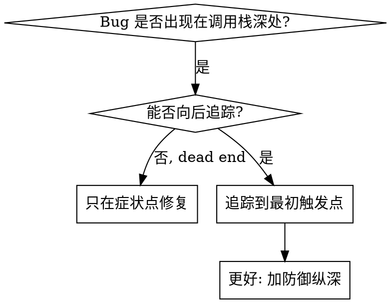
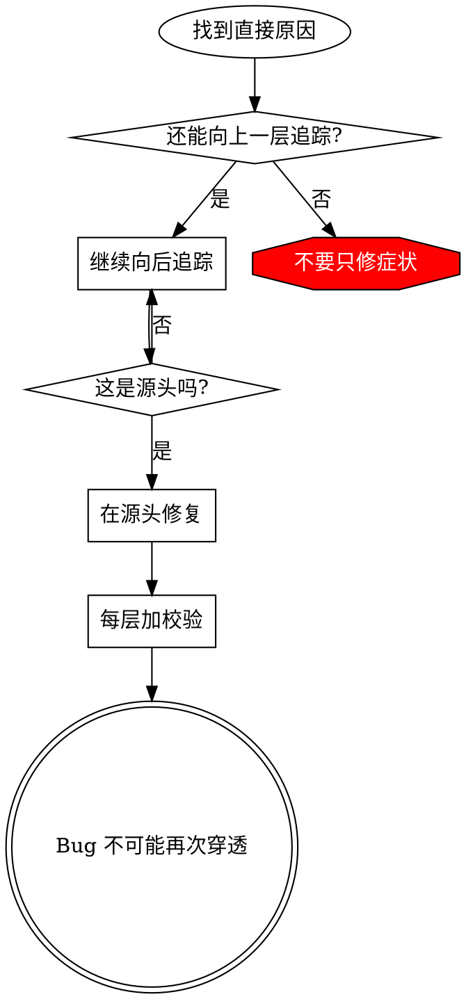

# 根因追踪

## 概览

Bug 经常在调用栈深处表现出来，例如 `git init` 跑在错误目录、文件创建到错误位置、数据库用错路径。直觉会让你在报错点修，但那通常只是症状。

**核心原则:** 沿调用链向后追踪，直到找到最初触发点，然后在源头修复。

## 何时使用



适用：

- 错误发生在深层执行路径，而不是入口处。
- stack trace 展示长调用链。
- 不清楚无效数据从哪里来。
- 需要找出哪个测试或代码触发了问题。

## 追踪流程

### 1. 观察症状

```text
Error: git init failed in ~/project/packages/core
```

### 2. 找直接原因

哪个代码直接造成它？

```typescript
await execFileAsync('git', ['init'], { cwd: projectDir });
```

### 3. 问：谁调用了它？

```text
WorktreeManager.createSessionWorktree(projectDir, sessionId)
  -> Session.initializeWorkspace()
  -> Session.create()
  -> test at Project.create()
```

### 4. 继续向上追踪

传入了什么值？

- `projectDir = ''`
- 空字符串作为 `cwd` 会解析成 `process.cwd()`
- 于是跑到了源码目录。

### 5. 找最初触发点

空字符串从哪里来？

```typescript
const context = setupCoreTest(); // Returns { tempDir: '' }
Project.create('name', context.tempDir); // beforeEach 前访问
```

## 添加 Stack Trace

无法手动追踪时，加临时 instrumentation：

```typescript
async function gitInit(directory: string) {
  const stack = new Error().stack;
  console.error('DEBUG git init:', {
    directory,
    cwd: process.cwd(),
    nodeEnv: process.env.NODE_ENV,
    stack,
  });

  await execFileAsync('git', ['init'], { cwd: directory });
}
```

测试中使用 `console.error()`，不要用可能被吞掉的 logger。

运行并捕获：

```bash
npm test 2>&1 | grep 'DEBUG git init'
```

分析 stack traces：

- 找测试文件名。
- 找触发行号。
- 找模式，是同一测试、同一参数还是同一路径。

## 找污染测试

如果测试运行中出现污染但不知道来源，使用本目录的 `find-polluter.sh`：

```bash
./find-polluter.sh '.git' 'src/**/*.test.ts'
```

脚本会逐个运行测试，找到第一个污染者。

## 真实示例：空 projectDir

症状：`.git` 被创建在 `packages/core/` 源码目录。

追踪链：

1. `git init` 跑在 `process.cwd()`，因为 cwd 参数为空。
2. WorktreeManager 收到空 `projectDir`。
3. `Session.create()` 传入空字符串。
4. 测试在 `beforeEach` 前访问 `context.tempDir`。
5. `setupCoreTest()` 初始返回 `{ tempDir: '' }`。

根因：顶层变量初始化时访问了尚未准备好的值。

修复：把 `tempDir` 改成 getter，在 `beforeEach` 前访问时抛错。

同时加防御纵深：

- Layer 1：`Project.create()` 校验 directory。
- Layer 2：`WorkspaceManager` 校验非空。
- Layer 3：`NODE_ENV` guard 禁止在 tmpdir 外执行 `git init`。
- Layer 4：`git init` 前打印 stack trace。

## 原则图



不要只在错误出现处修。追到最初触发点。

## Stack Trace 提示

- 测试中用 `console.error()`，logger 可能被抑制。
- 在危险操作前记录，而不是失败后。
- 包含目录、cwd、环境变量和时间戳。
- `new Error().stack` 能显示完整调用链。
