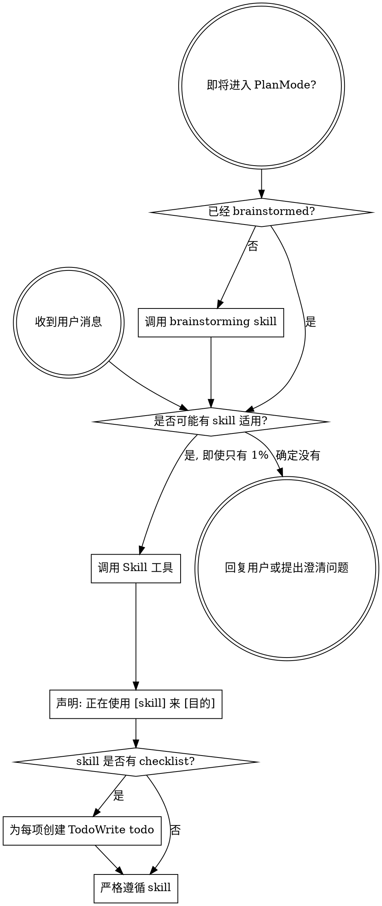

<SUBAGENT-STOP>
如果你是被派发来执行具体任务的子代理，请跳过本 skill。
</SUBAGENT-STOP>

<EXTREMELY-IMPORTANT>
只要你认为某个 skill 有 1% 的可能适用于当前任务，就必须调用该 skill。

如果某个 skill 适用于当前任务，你没有选择权，必须使用它。

这不是建议，不是可选项，也不能用“这次很简单”之类的理由绕过。
</EXTREMELY-IMPORTANT>

## 指令优先级

Superpowers skills 可以覆盖默认系统提示中的工作方式，但**用户指令永远优先**：

1. **用户的显式指令**，包括 CLAUDE.md、GEMINI.md、AGENTS.md 和直接请求，优先级最高。
2. **Superpowers skills**，在冲突时覆盖默认系统行为。
3. **默认系统提示**，优先级最低。

如果 CLAUDE.md、GEMINI.md 或 AGENTS.md 说“不要使用 TDD”，而某个 skill 说“一律使用 TDD”，按用户指令执行。用户掌控最终工作方式。

## 如何访问 Skills

**Claude Code:** 使用 `Skill` 工具。调用 skill 后，其内容会被加载并呈现给你，直接遵循即可。不要用 `Read` 工具读取 skill 文件。

**Copilot CLI:** 使用 `skill` 工具。skills 会从已安装插件中自动发现，行为与 Claude Code 的 `Skill` 工具类似。

**Gemini CLI:** 通过 `activate_skill` 工具激活。Gemini 会在会话开始时加载 skill 元数据，并按需激活完整内容。

**其他环境:** 查看平台文档，确认 skill 的加载方式。

## 平台适配

这些 skills 中会出现 Claude Code 的工具名。非 Claude Code 平台应参考：

- `references/copilot-tools.md`：Copilot CLI 工具映射
- `references/codex-tools.md`：Codex 工具映射
- `references/gemini-tools.md`：Gemini CLI 工具映射

Gemini CLI 用户通常会通过 GEMINI.md 自动获得工具映射。

# 使用 Skills

## 基本规则

**在任何回复或行动之前，先调用相关或被点名的 skill。** 只要有 1% 的可能适用，就先调用检查。如果调用后发现不适合，可以不采用。

## 危险信号

出现这些想法时要停下来，因为你正在找理由绕过流程：

| 想法 | 事实 |
|---|---|
| “这只是个简单问题” | 问题也是任务。先检查 skills。 |
| “我需要先要更多上下文” | 澄清问题之前也要先检查 skill。 |
| “我先看看代码库” | skill 会告诉你如何探索。先检查。 |
| “我可以快速看一下 git 或文件” | 文件没有完整对话上下文。先检查 skill。 |
| “我先收集信息” | skill 会告诉你如何收集信息。 |
| “这不需要正式 skill” | 如果 skill 存在，就用它。 |
| “我记得这个 skill” | skill 会演进。读取当前版本。 |
| “这不算任务” | 行动就是任务。先检查。 |
| “这个 skill 太重了” | 简单任务也会因为假设错误变复杂。用 skill。 |
| “我先做这一小步” | 做任何事之前先检查。 |
| “这样更快” | 无纪律的行动会浪费时间。skill 用来防止返工。 |
| “我知道它是什么意思” | 理解概念不等于使用 skill。调用它。 |

## Skill 优先级

多个 skill 可能适用时，按此顺序：

1. **流程类 skill 优先**，例如 `brainstorming`、`systematic-debugging`，它们决定如何做事。
2. **实现类 skill 其次**，例如 frontend-design、mcp-builder 等，它们指导具体执行。

“我们来构建 X”应先使用 `brainstorming`，再使用实现类 skill。

“修复这个 bug”应先使用 `systematic-debugging`，再使用领域相关 skill。

## Skill 类型

**刚性 skill**，例如 TDD、debugging：严格执行，不要把纪律“灵活化”掉。

**弹性 skill**，例如 patterns：按原则适配当前上下文。

具体以每个 skill 自身说明为准。

## 用户指令

用户指令定义“做什么”，不代表可以跳过“如何做”。“添加 X”或“修复 Y”不等于跳过工作流。
